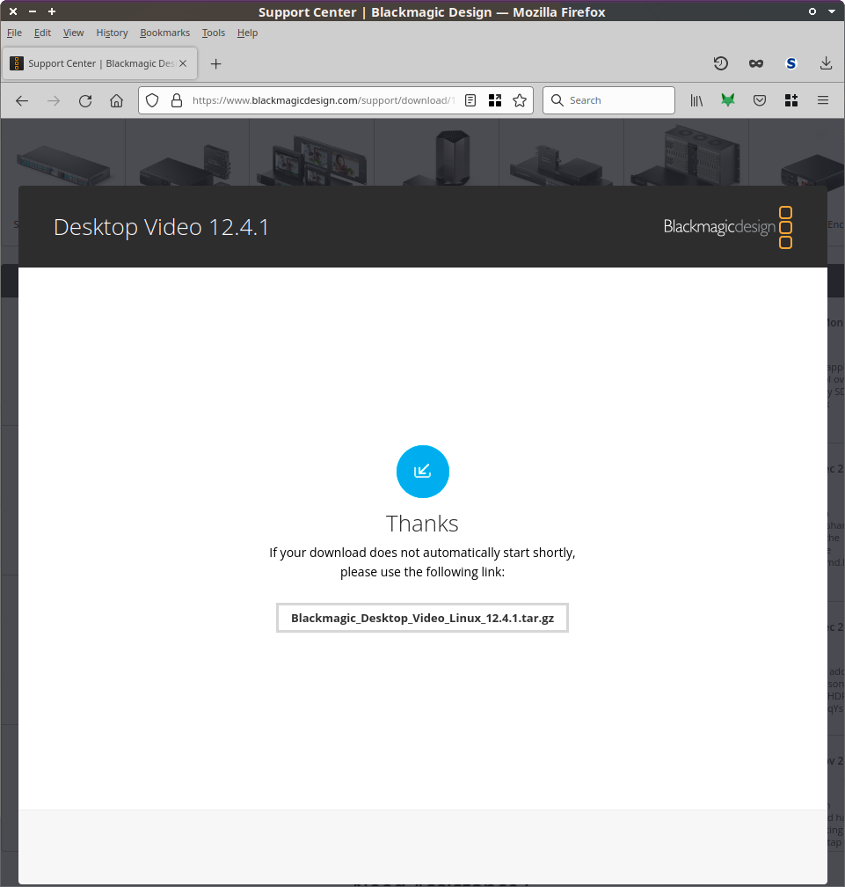

# Installation instructions for 'vrecordX'

# For Xubuntu 20.04.6

The installation consists of 2 different components:

  1. vrecordX  
     (bash-GUI + CLI tools in the background)

  2. Blackmagic drivers  
     (DesktopVideo tools and MediaExpress)
     

## vrecordX: Install "make":

Most of the setup and installation is done using **Makefiles**
in the good old "[GNU Make](https://www.gnu.org/software/make/)" syntax.

GNU `make` is a tool well-known and widely supported among program developers.
You'll also need the `git` tool to checkout vrecordX's code:

Simply install `make` and `git` like this:

`$ sudo apt install make git`


## Download (clone) git repository

Create a subfolder in `/opt` and assign full ownership (write access) to the currently logged-in user:

`$ sudo mkdir /opt/vrecordX && sudo chown $USER /opt/vrecordX`

Download the current copy of vrecordX from Github into that folder:

`$ git clone https://github.com/ArkThis/vrecordX.git /opt/vrecordX`


## Install prerequisites

Each folder of vrecordX contains a "Makefile" that holds all the instructions
necessary to perform the setup.

In the folder where you have the copy of vrecordX, run the following to build
and install all required non-packaged dependencies (like FFmpeg, GTKdialog):

`$ cd /opt/vrecordX`

`$ make all`

Once that has completed successfully, run install:

`$ make install`

This will copy the built binaries into your operating system's folders.


# Blackmagic Drivers

## Download from Website

To download the Blackmagic Decklink drivers, go to their [Support Page for 'Capture & Playback'](https://www.blackmagicdesign.com/support/family/capture-and-playback):


On the left-hand side, you should see the "Desktop Video" downloads:
"Software Update" and "Developer SDK".

For example:

> **Desktop Video 12.4.1** => `Blackmagic_Desktop_Video_Linux_12.4.1.tar.gz`



You may try the following download-link to get the right package directly (if Blackmagic allows):
[https://swr.cloud.blackmagicdesign.com/DesktopVideo/v12.4.1/Blackmagic_Desktop_Video_Linux_12.4.1.tar.gz](https://swr.cloud.blackmagicdesign.com/DesktopVideo/v12.4.1/Blackmagic_Desktop_Video_Linux_12.4.1.tar.gz?verify=1702550325-jatrdQOiCRo3A0weiYeeyOaelrebz70jrRRZXx5OtpI%3D)

The SDK source code files are already included in this git repository, so you
only need to download the "Desktop Video" package - *for Linux*. You may skip
entering your personal information for Blackmagic, and use the "Download Only"
option in the lower-left corner:


## Unpack the Debian Packages

Within the tarball (.tar.gz) file, extract only the following 3 packages in the
subfolder `deb/x86_64` (for 64bit Debian-based systems):


For example:

  * desktopvideo_12.4.1a15_amd64.deb
  * desktopvideo-gui_12.4.1a15_amd64.deb
  * mediaexpress_3.8.1a4_amd64.deb


## Install the Debian Packages

```
$ sudo apt install \
./desktopvideo_12.4.1a15_amd64.deb \
./desktopvideo-gui_12.4.1a15_amd64.deb \
./mediaexpress_3.8.1a4_amd64.deb
```

(Update the command accordingly to match the version numbers you're actually installing)

You may need to follow apt's instructions for automatically resolving required
package dependencies.  After a successful installation, please open the
Blackmagic configuration tool to see if your card(s) show up; Then reboot the
machine to finalize the driver installation.

**NOTE:** It is important that you've started any Blackmagic Tool *at least
once* after driver installation on a fresh system. Otherwise, other tools (eg
FFmpeg) may say they cannot find any capture card.


# Starting vrecordX GUI

```
$ cd /opt/vrecordX
./vrecord
```
