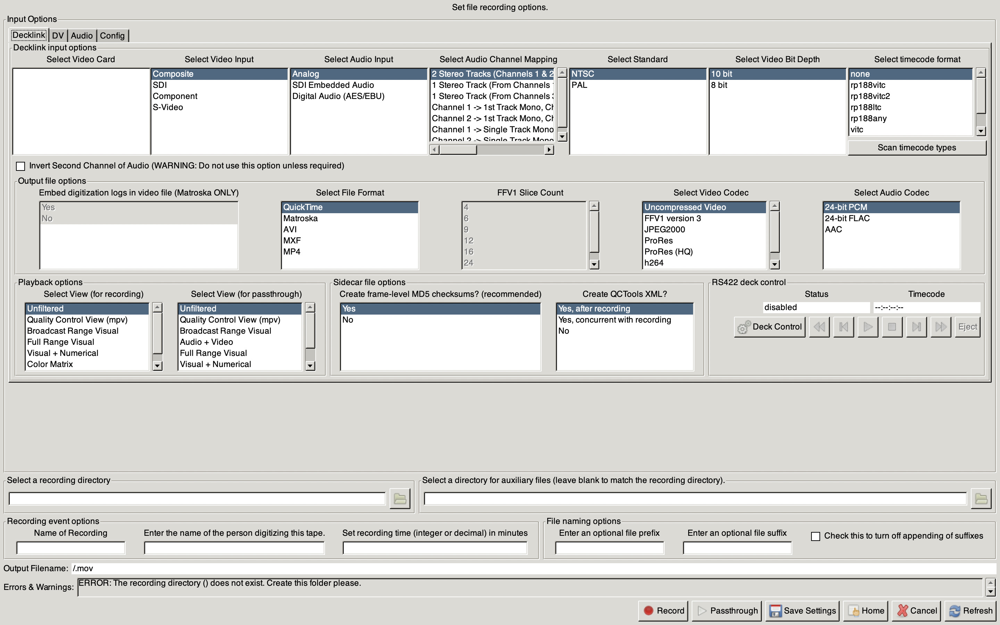
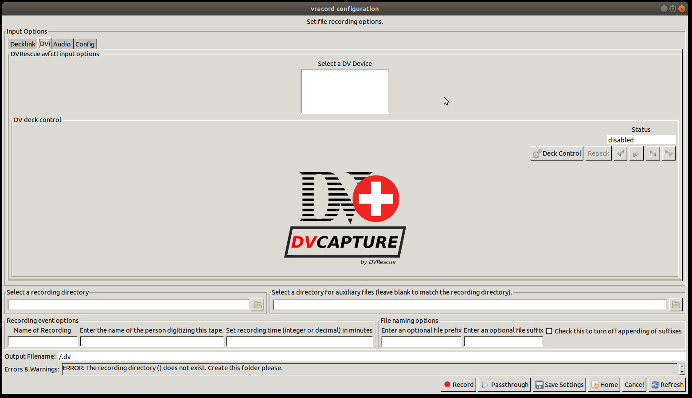
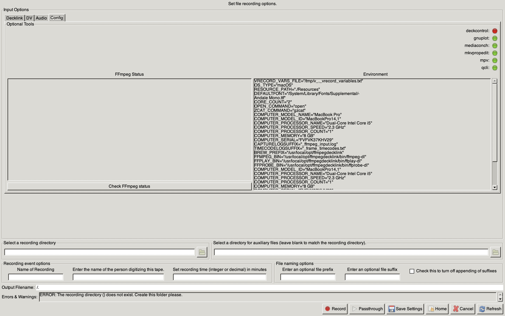

# DV Capture

To capture DV formats in vrecord (when installed in macOS), you will need to have your DV deck connected directly to your computer via FireWire input. Make sure your deck is in “Local” mode.

## DV Settings

1. To select the deck you would like to use, go into the configuration mode either by:
   - run `vrecord -e`
   - clicking on the "Edit Settings" button in the GUI (run `vrecord`)

 

1. Switch from the "Decklink" tab to the "DV" tab under "Input Options" at the top of the configuration window.

 

1. Select the name of the DV device you want to use from the list.

1. Specify the playback, sidecar, file naming, recording event and directory options as you normally would for vrecord. For details see [Editing Settings](Resources/Documentation/settings.md)

1. Click "OK" to save.

You can then run passthrough and record modes the same as you would with analog videotape. Please note that if the timecode does not start at the very beginning of the tape, the record mode viewer will not open until the timecode is detected (as soon as the counter starts moving on your deck, the viewer window should pop-up)

When using the GUI, environment parameters can be adjusted in the Config tab.

  

## Bitstream Error Concealment

If vrecord detects that the DV device is concealing bitstream errors, this will be noted in the Terminal.

